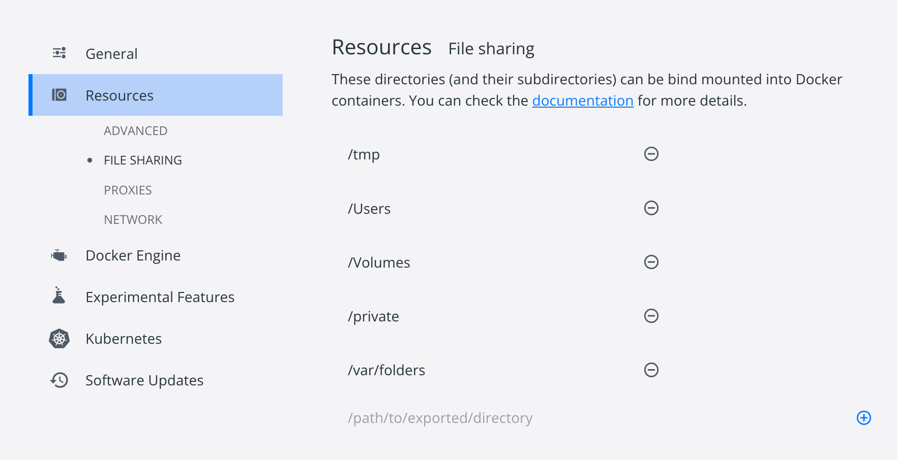
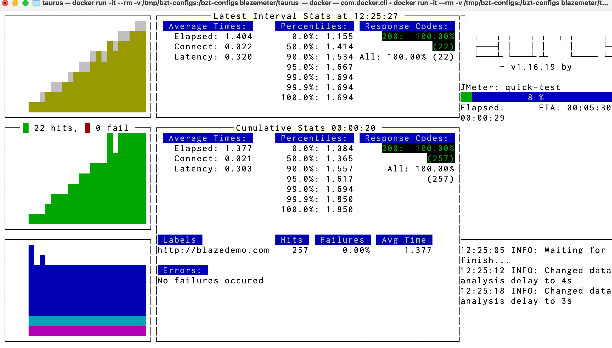

# Taurus

## インストール

```
docker pull blazemeter/taurus
```

---

ローカルに作ったディレクトリを指定したら以下のようなエラーが出て少しハマった。

```bash
$ docker run -it --rm -v /getting-started:/bzt-configs blazemeter/taurus quick_test.yml  

ERRO[0000] error waiting for container: context canceled 
docker: Error response from daemon: Mounts denied: 
The path /getting-started is not shared from the host and is not known to Docker.
You can configure shared paths from Docker -> Preferences... -> Resources -> File Sharing.
See https://docs.docker.com/desktop/mac for more info.
```

Docker for Macの設定で、Dockerイメージ側とバインドできるディレクトリが予め決まっていた様子。



なので、設定に従って `/tmp/bzt-configs`  と `/tmp/bzt-configs/my-config.yml` を作成してから

```bash
$ docker run -it --rm -v /tmp/bzt-configs:/bzt-configs blazemeter/taurus my-config.yml

12:20:38 INFO: Taurus CLI Tool v1.16.19
12:20:38 INFO: Starting with configs: ['/root/.bzt-rc', 'my-config.yml']
12:20:38 INFO: Configuring...
12:20:38 INFO: Artifacts dir: /tmp/artifacts
12:20:38 INFO: Preparing...
12:20:38 WARNING: Failed to check for updates
12:20:45 INFO: Starting...
12:20:45 INFO: Waiting for results...
12:20:46 INFO: Waiting for finish...
12:20:52 INFO: Changed data analysis delay to 4s
12:20:59 INFO: Changed data analysis delay to 3s
12:21:12 INFO: Changed data analysis delay to 4s
12:21:23 INFO: Changed data analysis delay to 11s
12:21:49 INFO: Changed data analysis delay to 10s
12:21:55 INFO: Changed data analysis delay to 20s
12:22:05 INFO: Changed data analysis delay to 21s
12:22:21 INFO: Changed data analysis delay to 20s
12:22:55 INFO: Changed data analysis delay to 19s
12:23:08 INFO: Changed data analysis delay to 20s
12:23:22 INFO: Changed data analysis delay to 21s
12:23:24 WARNING: Please wait for graceful shutdown...
12:23:24 INFO: Shutting down...
12:23:25 INFO: Sending Shutdown command to JMeter on port 4445...
12:23:27 WARNING: Keyboard interrupt
12:23:27 INFO: Post-processing...
12:23:27 INFO: Test duration: 0:02:42
12:23:27 INFO: Samples count: 2450, 0.57% failures
12:23:27 INFO: Average times: total 4.346, latency 0.760, connect 0.333
12:23:27 INFO: Percentiles:
+---------------+---------------+
| Percentile, % | Resp. Time, s |
+---------------+---------------+
|           0.0 |         1.144 |
|          50.0 |         2.858 |
|          90.0 |         8.936 |
|          95.0 |        10.328 |
|          99.0 |        31.392 |
|          99.9 |        36.448 |
|         100.0 |        36.864 |
+---------------+---------------+
12:23:27 INFO: Request label stats:
+----------------------+--------+--------+--------+-------+
| label                | status |   succ | avg_rt | error |
+----------------------+--------+--------+--------+-------+
| http://blazedemo.com |  FAIL  | 99.43% |  4.346 | Found |
+----------------------+--------+--------+--------+-------+
12:23:27 INFO: Artifacts dir: /tmp/artifacts
12:23:27 WARNING: Done performing with code: 1
```

起動中の画面。



---

## memo

dockerコマンドの `-v` オプション。

[https://docs.docker.jp/v19.03/engine/reference/commandline/run.html#v-read-only](https://docs.docker.jp/v19.03/engine/reference/commandline/run.html#v-read-only)

```bash
-v フラグは現在の作業ディレクトリをコンテナ内にマウントします。
-w によって、コマンドは現在の作業用ディレクトリの中で実行されます。
ディレクトリとは、 pwd を実行して得られるディレクトリが該当します。
このコマンドを組み合わせててコンテナを実行しても、現在の作業ディレクトリの中で実行されるのです。
```

`docker run -it --rm -v /tmp/bzt-configs:/bzt-configs`  であれば、

ローカルの `/tmp/bzt-configs` が

 イメージ内の `/bzt-configs` にマウントされる。

このコマンドであれば、イメージ内で以下のように実行される。

`bzt /bzt-configs/my-config.yml`